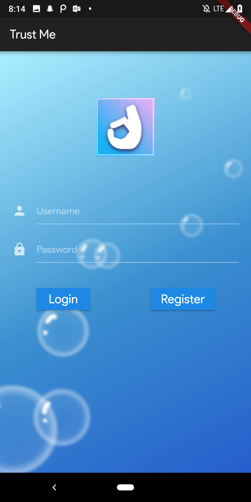
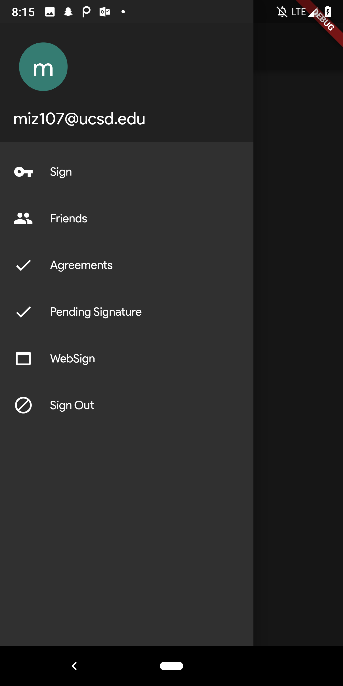
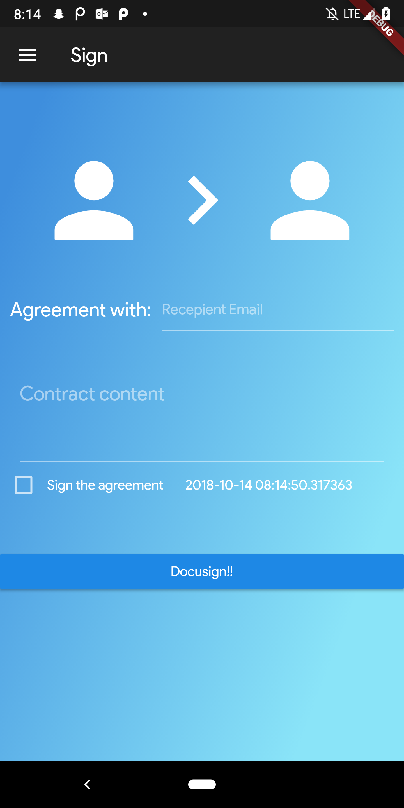

# TrustMe

## What it does
We help you and your friends make good on your agreements no matter how big.
From a $1 bet to year long commitments, we help you formalize any promise
quickly with our intuitive mobile platform.  While you are on the move
immediately draft your agreements, share your agreements and finalize your
agreements with our signing service

## Use cases
We believe we can use this mobile accountability platform into a proof of
trustworthiness. Because your agreements are public to the community and to
your network, you have the ability to show off your strength in following
through with your agreements.  With a strong _trustworthiness score_ the
applications are endless with 3rd parties such as:
* Networking
* Loans
* Renting (houses, equipment, etc)
* Work Arrangements

## How We Built It
The project consisted of 3 parts
* Request to DocuSign API for signature handling
* Flutter.io frontend
* Node.js API hosted on Google Cloud Platform (GCP)

## Screenshots

